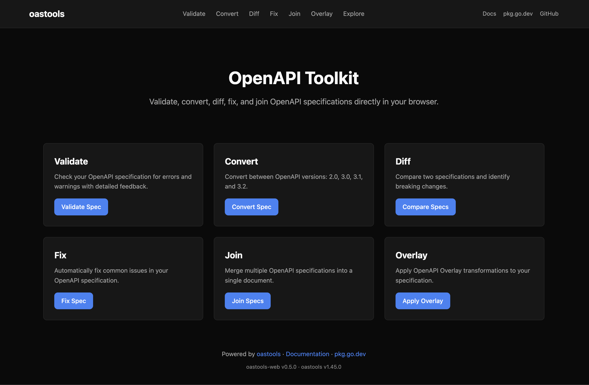
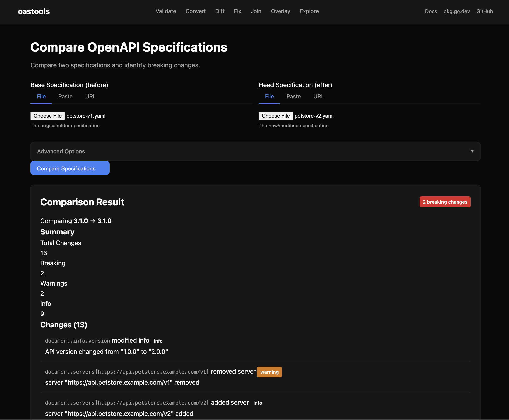
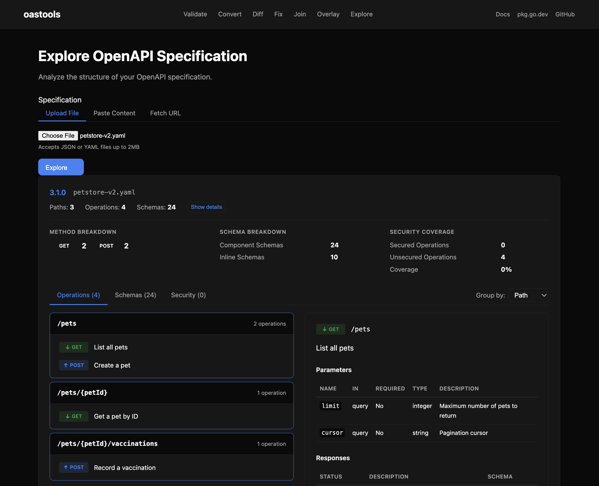

# oastools-web

[](https://github.com/erraggy/oastools-web/actions/workflows/go.yml)
[](https://github.com/erraggy/oastools-web/actions/workflows/docker.yml)

A web app showcasing [oastools](https://github.com/erraggy/oastools) — a Go toolkit for OpenAPI specifications.

**[Try it live →](https://oastools.robnrob.com)**



## Part of the oastools ecosystem

| Resource | Description |
|----------|-------------|
| [oastools](https://github.com/erraggy/oastools) | Go library for OpenAPI validation, conversion, diffing, and more |
| [Documentation](https://erraggy.github.io/oastools) | Guides and examples |
| [pkg.go.dev](https://pkg.go.dev/github.com/erraggy/oastools) | API reference |
| **This app** | Interactive demo and online tools |

## Features

### Validate

Check specs for errors and warnings. Catch issues before they break code generation or API gateways.

[Deep Dive](https://erraggy.github.io/oastools/packages/validator/) · [pkg.go.dev](https://pkg.go.dev/github.com/erraggy/oastools/validator)

### Convert

Transform between OpenAPI 2.0 (Swagger), 3.0, 3.1, and 3.2. Migrate legacy specs without manual rewrites.

[Deep Dive](https://erraggy.github.io/oastools/packages/converter/) · [pkg.go.dev](https://pkg.go.dev/github.com/erraggy/oastools/converter)

### Diff

Compare two specs and identify breaking vs non-breaking changes. Know what's safe to deploy.

[Deep Dive](https://erraggy.github.io/oastools/packages/differ/) · [pkg.go.dev](https://pkg.go.dev/github.com/erraggy/oastools/differ)



### Fix

Automatically repair common spec issues. Preview changes before applying with dry-run mode.

[Deep Dive](https://erraggy.github.io/oastools/packages/fixer/) · [pkg.go.dev](https://pkg.go.dev/github.com/erraggy/oastools/fixer)

### Join

Merge multiple specs into one. Useful for microservices consolidation or documentation aggregation.

[Deep Dive](https://erraggy.github.io/oastools/packages/joiner/) · [pkg.go.dev](https://pkg.go.dev/github.com/erraggy/oastools/joiner)

### Overlay

Apply RFC-compliant overlay documents to modify specs without touching the original.

[Deep Dive](https://erraggy.github.io/oastools/packages/overlay/) · [pkg.go.dev](https://pkg.go.dev/github.com/erraggy/oastools/overlay)

### Explore

Analyze spec structure — endpoints, schemas, dependencies. Understand unfamiliar APIs quickly.

[Deep Dive](https://erraggy.github.io/oastools/packages/parser/) · [pkg.go.dev](https://pkg.go.dev/github.com/erraggy/oastools/parser)



## For Go Developers

This web app is built with oastools' `builder.ServerBuilder` — the same toolkit you can use in your own projects. See the [library documentation](https://erraggy.github.io/oastools) to get started.

## Tech Stack

- **Backend:** Go with oastools `builder.ServerBuilder`
- **Frontend:** HTMX + Go html/template (no JS build step)
- **Hosting:** Google Cloud Run (scale-to-zero)

## Local Development

```bash
make build    # Build the server
make run      # Run locally
make test     # Run tests
make check    # Run all checks (tidy, fmt, vet, lint, test, build)
```

## License

MIT
